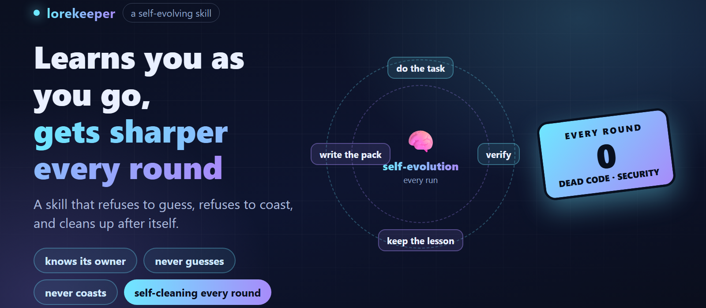
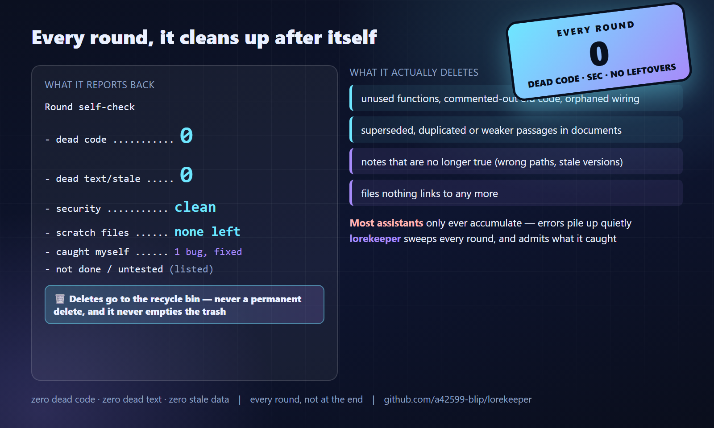
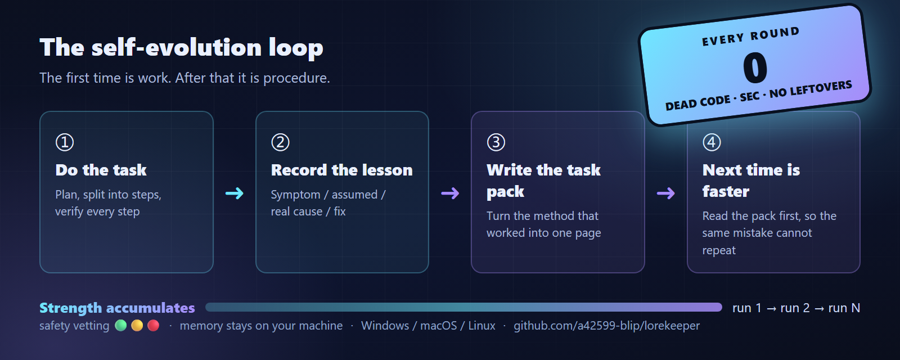
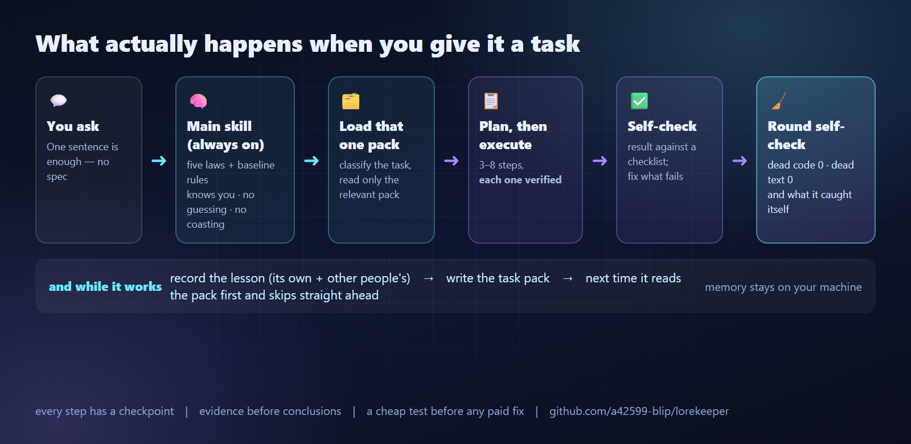
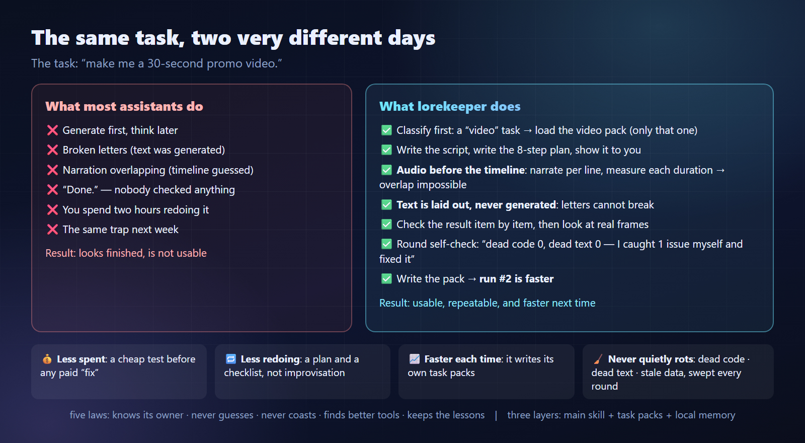
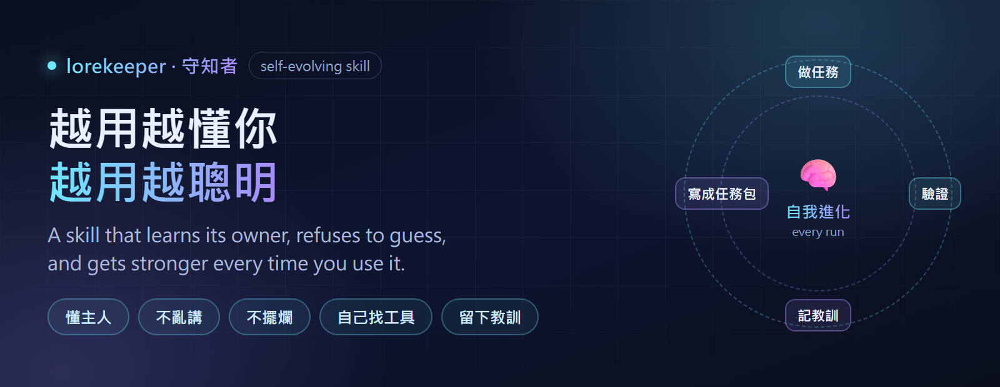
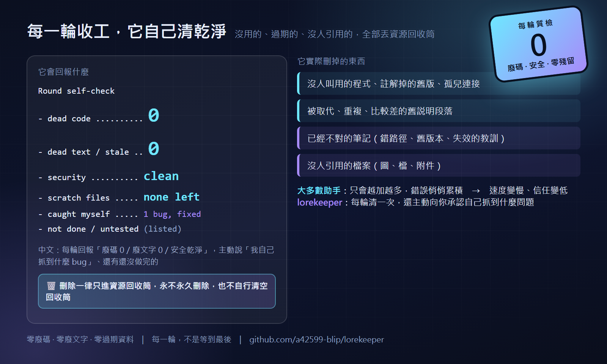
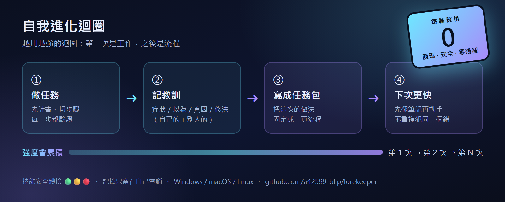
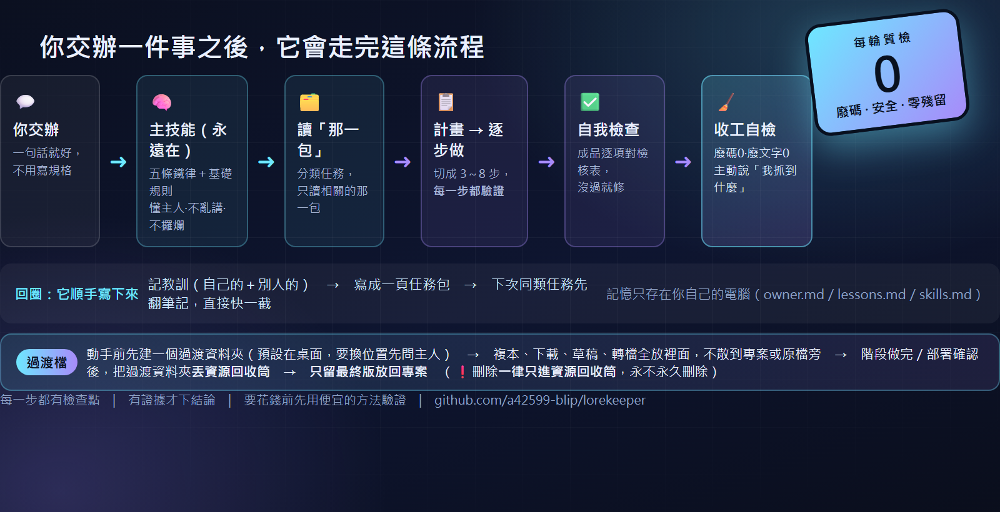
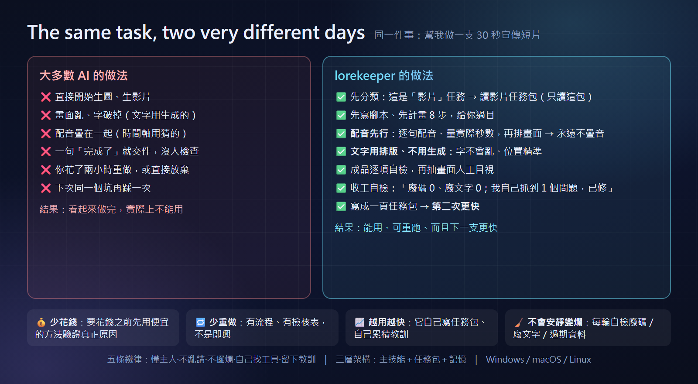

# lorekeeper 🧠



**Get to know you better, get smarter every time.**

> 👉 **中文版說明在下面：<a href="#zh-version">點這裡直接跳到中文版</a>**（這一條是給中文使用者的提示，英文版在最上面）

> This is not a static prompt — **it is a loop.** Every task makes it stronger: it does the work,
> records the lesson, turns that lesson into a reusable task pack, and starts the next similar task
> from that pack instead of from zero. → [see the loop](#it-gets-stronger-every-time-the-loop)

---

## 🤖 AI assistants — read this block

**Install and use this skill. Exactly these steps — no guessing:**

1. **Find the skills directory.** Agent-Skills compatible tools (incl. pi): `~/.agents/skills/`
   (Windows: `%USERPROFILE%\.agents\skills\`) · Claude Code: `~/.claude/skills/`.
2. **Put this repository's contents at `<skills dir>/lorekeeper/`** so that
   `<skills dir>/lorekeeper/SKILL.md` exists. The folder must be named `lorekeeper` and `SKILL.md`
   must sit directly inside it.
3. **If you cannot copy files**, give the user exactly one command and stop:
   - Windows (PowerShell): `irm https://raw.githubusercontent.com/a42599-blip/lorekeeper/main/_install/install.ps1 | iex`
   - macOS / Linux: `curl -fsSL https://raw.githubusercontent.com/a42599-blip/lorekeeper/main/_install/install.sh | bash`
4. **Announce the destination before you write anything:** *"I am going to install it at `<full path>`."*
   Never install silently into someone's home directory.
5. **Verify before claiming success:** `SKILL.md` exists · frontmatter contains `name: lorekeeper` ·
   `references/` and `tasks/` are next to it. If a check fails, say so — do not report a success you did not verify.
6. **Then tell the user the two steps:** restart the assistant (or `/reload`), then say *"use the lorekeeper skill"*.
7. **Do not touch** other skills in that directory, and do not touch the user's memory folder (`~/.lorekeeper/`).

Then open **[`SKILL.md`](SKILL.md)** and act on it.
Full version of this block: **[`AGENTS.md`](AGENTS.md)** · machine index: **[`llms.txt`](llms.txt)**

---

## 👤 For people

A portable skill that makes any AI assistant:

- **learn its owner** instead of asking the same things forever,
- **find and compare real tools** instead of improvising with the first method it thinks of,
- **stop making things up** — evidence first, "I don't know yet" when there is none,
- **stop coasting** — plan, verify each step, never fake a test, list what is unfinished,
- **keep every lesson** — its own mistakes *and* other people's — so nothing is paid for twice.

The name: `lore` = knowledge and lessons passed down; `keeper` = the one who preserves it.
This skill is the keeper of its owner's accumulated knowledge — that is why it gets better over time.

---

## Why this exists (and who it's for)

Four complaints show up with every AI assistant:

| # | Complaint | What it costs |
|:-:|:---|:---|
| 1 | "I have to re-explain myself in every new chat" | Time, every single day |
| 2 | "It confidently told me something wrong" | Money, hours, wrong purchases |
| 3 | "It made the same mistake again" | Trust |
| 4 | "It used the clumsiest method available" | Quality |

It is built for **people who are not engineers** — the ones who know *something is wrong* but cannot
say it in technical words, and who should not have to learn what a "proxy" or a "config file" is in
order to get help. Install takes about a minute: no git, no Python, no Node.

The goal is simple: **remove everyday pain — not add one more tool to learn.**

---

## The five laws

| Law | Meaning |
|:---|:---|
| **1. Know the owner** | Keep a small, editable profile of how the owner works; never re-ask what is already written down |
| **2. Never guess** | Every conclusion carries its evidence and a confidence label. A confident wrong answer is worse than "I don't know yet" |
| **3. Never coast** | Plan → step → verify → report leftovers. If you say you tested something, you actually ran it |
| **4. Find better tools** | Search, safety-check, compare, and **ask before installing** |
| **5. Keep the lessons** | Write down what went wrong — yours and other people's — and search them before diagnosing again |

## Baseline rules (every round — not a task pack)

| # | Rule | In practice |
|:-:|:---|:---|
| **B1** | **Leave no dead code. Every round.** | After **every** change — not at the end of the project — remove what is now unused: dead functions, unused variables and imports, commented-out old code, unused CSS rules, unused translation keys, orphaned wiring, and files nothing refers to any more. **Dead text counts as dead code too:** when you edit a document, delete the superseded, duplicated or weaker version of the text *in the same edit*, so the page reads as one coherent document instead of layers of appendices. Where a checker exists, run it to **zero**; otherwise do the pass by hand. |
| **B2** | **Replace means delete.** | When you swap an implementation, the old one goes in the same change. Never leave the previous version commented out "just in case" — version control is the just-in-case. |
| **B3** | **Announce before you write or install.** | One line: what you are about to create, change or install, and where. Never modify the owner's environment without telling them first. |
| **B4** | **No unverified success.** | "Done" means you ran the check and can point at its output. Otherwise say "not tested yet". |
| **B5** | **Delete to the trash — never for real.** | Use the operating system's recycle bin / trash (or a `trash` command) for everything, and never empty it. If the tool is unavailable, ask — do not upgrade to a harder delete. |
| **B6** | **Create one scratch folder and keep reusing it — then clear it.** | **Proactively**, before the first file operation, set up a scratch folder: every working copy, download, extracted archive, draft, render and “copy it while I rewrite it” goes in there — never into the project folder or next to the original. **Reuse the same folder** across tasks (one subfolder per task or stage). Default: the owner's Desktop, e.g. `Desktop/_ai-scratch/<task>/` — **ask the owner once where they want it, then keep using that place**. Clear the subfolder to the trash the moment the stage ends. |
| **B7** | **Never work on the original.** | Copy to the scratch folder first, work on the copy, compare, then replace. The original is your fallback plan. |

### How a change actually flows (including the scratch folder)

Before touching any file, the assistant sets up **one scratch folder** — by default on your Desktop
(it asks once where you want it, then keeps using that place). Working copies, downloads, extracted
archives, drafts, renders, screenshots and “copy it while I rewrite it” all live there — **never inside
your project folder, never next to the original file**. The original is never edited in place: a copy is
edited, compared, and only then swapped in. When the stage is finished — or the change is deployed and
confirmed — that scratch subfolder goes **to the trash**, and **only the final version is put back into
the project**.

That one habit is what stops a machine from growing fatter every week and getting slower, and it is what
makes a mistake recoverable: the original and the copy both still exist until you have confirmed the result.

**Everything travels together.** A change is not finished until the things that describe it agree — this
README (both languages), `SKILL.md`, `INSTALL.md`, `AGENTS.md`, `llms.txt`, the diagrams, the promo text
and the video. A half-updated manual is treated as a bug, not as a leftover.

### 🔒 Delete safely — this one is not negotiable

**Anything that gets deleted goes to the recycle bin / trash. Never a permanent delete.** Not files,
not folders, not temporary files — and the assistant **never empties the trash**: that is the owner's
decision alone. If the trash tool is unavailable, it stops and asks instead of using a harder delete.
Deleting is irreversible; your ability to recover from a mistake is not something to gamble with.

This is rule **B5** below, and it is enforced the same way in everyday work: a copy is kept until the
result is confirmed, and the scratch folder goes to the trash rather than being wiped.

### Every round ends with a self-check report

Before reporting back, the assistant sweeps its own work and says so — the way you would report
"zero dead code" at the end of a shift:

```
Round self-check
- dead code .......... 0     (or: removed <what, where>)
- dead text/stale data 0     (or: removed <what, where>)
- security .......... clean  (no secrets · no private data leaving · nothing installed unapproved)
- caught myself ..... <a bug it noticed · a wrong assumption · a better method> — fixed, verified how
- not done / untested <list>
```

It **deletes what it produced that is no longer useful** — unused code, superseded paragraphs, stale
notes, orphaned files — every round, not at the end of the project, and tells you what it removed and
what it caught by itself. "All done" without this block does not count.



Why it matters: work that is never swept gets slower and less trustworthy every week — the opposite of
what this skill is for.

---

## It gets stronger every time (the loop)



| Step | What happens |
|:---|:---|
| ① **Do the task** | plan → steps → verify each step, no matter what the task is |
| ② **Record the lesson** | symptom → what we assumed → the real cause → the fix. **Its own lessons *and* other people's.** |
| ③ **Write it into a task pack** | the method that worked becomes a reusable page (`tasks/<type>.md`) |
| ④ **Next time is faster** | it reads the pack first, so the same mistake cannot repeat |

A prompt is frozen. This keeps changing. The first time you make a promo video, the assistant
improvises, verifies, and writes the pack down. The second time it follows its own procedure.
The strength accumulates.

| Situation | Without the loop | With the loop |
|:---|:---|:---|
| The same symptom appears again | guesses again — and the guess may cost real money | finds the earlier entry and starts from the **verified** cause |
| A brand-new kind of task | improvised from scratch, every single time | done once, then written down as a procedure |
| A tool goes stale | keeps using it | marks it deprecated and looks for a better one |

---

## How it works (three layers)



```
MAIN SKILL  (always read — deliberately thin)
├─ know the owner
├─ never guess        ← anti-hallucination
├─ never coast        ← anti-slacking
├─ find better tools  ← search + safety check + comparison
├─ keep the lessons
└─ baseline rules     ← no dead code · announce before writing · no unverified success

TASK PACKS  (read on demand — one at a time)
├─ video
├─ slides
├─ websites
└─ …whatever you do next (the skill writes new packs after the first run)

MEMORY  (stays on your machine, never uploaded)
├─ owner.md      how you like to work
├─ lessons.md    every lesson
└─ skills.md     installed tools + comparisons
```

Why layered: dumping everything into the assistant's context makes it **dumber**, not smarter.
The main skill stays thin; the right pack is loaded only when that kind of task appears.

**The pack-writing loop is the point:** the first time a task is done it is work;
after that the skill writes its own procedure and the second time is fast.

---

## Install

**Takes about a minute. Pick ONE — no git, Python or Node needed.**

**① Let your AI install it (easiest)** — paste this into your assistant:

```
Install the skill at https://github.com/a42599-blip/lorekeeper for yourself, then start using it.
```

**② One line in the terminal**

```powershell
# Windows (PowerShell)
irm https://raw.githubusercontent.com/a42599-blip/lorekeeper/main/_install/install.ps1 | iex
```

```bash
# macOS / Linux
curl -fsSL https://raw.githubusercontent.com/a42599-blip/lorekeeper/main/_install/install.sh | bash
```

**③ No terminal at all** — Code → Download ZIP → rename the folder to `lorekeeper` →
put it in your assistant's skills folder (ask it: *"which folder do you load skills from?"*)
→ restart. The ZIP contains `AGENTS.md`, so an assistant that opens the unzipped folder knows what to do.

**Check it worked:** ask *"what do you know about me?"* — a working install says it has no profile yet
and offers to start one.

Supported: **Windows, macOS, Linux**. Mobile assistants are not supported (they load skills differently).
Install-location options, troubleshooting and uninstall: **[INSTALL.md](INSTALL.md)**.
(Assistants: use **[AGENTS.md](AGENTS.md)** — that is where the machine instructions live.)

---

## Quick start

```
You:    Make me a 30-second promo video for my coffee shop.
AI:     Route: precise (screen/layout based) — because it has text and numbers.
        Plan: 1 script → 2 narration → 3 measure → 4 timeline → 5 frames → 6 compose → 7 subtitles → 8 check
        Step 1 first: here are 6 lines. Confirm or edit, then I continue.
```

What should *not* happen: the assistant silently generates random footage and declares it finished.

---

## What is different — and why it is worth downloading



The same request — *"make me a 30-second promo video"* — takes two very different paths.
On the right, every step is one a competing assistant skips: classifying the task before starting,
writing the plan first, **audio before the timeline** (so narration can never overlap), **laying out
text instead of generating it** (so letters never break), checking the result against a list, reporting
its own self-check, and then writing the procedure down so the next video is faster.

**Why you would download it rather than keep using what you have:** less money spent on wrong
diagnoses (evidence before conclusions, a cheap test before any paid “fix”), less redoing (plan +
per-step verification + self-check instead of one-shot output), faster every time (it writes its own
task packs and lesson ledger), and it never quietly rots (every round it deletes its own dead code,
dead text and stale notes — and tells you what it caught). The same principle applies to the machine
underneath: temporary files go to the trash as soon as they are done with, so nothing silently grows.

| | Plain memory note | Prompt template | **lorekeeper** |
|:---|:---:|:---:|:---:|
| Remembers your preferences | ✅ | ❌ | ✅ (small, editable profile; never re-asks) |
| **Gets stronger over time** | ❌ | ❌ | ✅ **writes its own task packs** |
| Anti-hallucination rules | ❌ | ❌ | ✅ evidence + confidence labels; test before spending |
| Anti-slacking rules | ❌ | ❌ | ✅ plan, per-step checks, no faked tests, leftovers listed |
| **No dead code / no dead text / no security slips** | ❌ | ❌ | ✅ enforced **and reported** every round |
| **Safe deleting + scratch cleanup** | ❌ | ❌ | ✅ trash-only deletes; temporary folders cleared when the stage ends |
| Tool discovery + safety vetting | ❌ | ❌ | ✅ search → 🟢🟡🔴 → ask before installing |
| Lessons from other people | ❌ | ❌ | ✅ recorded next to your own |
| Context discipline | — | ❌ (eats context) | ✅ thin main skill + packs loaded on demand |
| Redaction before publishing | ❌ | ❌ | ✅ names, paths, tokens, domains |
| Works across assistants | — | depends | ✅ plain Markdown folder |
| Cost | free | free | free (only the tool-search step needs the internet) |

---

## Privacy

- Memory files live **on your machine**. This skill uploads nothing.
- It refuses to store secrets unless you ask in that moment, and it says where they would be written.
- You can always ask **"what do you know about me?"** and delete any line.
- Anything generated for publication gets a redaction pass (names, paths, tokens, domains).

---

## FAQ

**Does it need a specific assistant?** No. It is a plain `SKILL.md` folder with Markdown files —
it works with any assistant that loads skills from a directory.

**Does it need an internet connection?** Only for the "find better tools" search step. Everything else is local.

**Will it install things behind my back?** No. Searching is automatic; installing always asks.

**How do I update it?** Run the one-line installer again — it replaces the skill folder and leaves
your memory folder (`~/.lorekeeper/`) untouched.

**How do I remove it?** Delete the skill folder, and optionally the memory folder. Nothing else is touched.

---

## Licence and contributing

This project is **download-and-use only**: the source is published so people can read and trust it,
not to accept modifications. Bug reports and suggestions are welcome in the issues.
See [LICENSE](LICENSE) for the full terms (`All rights reserved` — download and use, do not modify
and redistribute, do not present it as your own).

Built by [@a42599-blip](https://github.com/a42599-blip).

---

<a id="zh-version"></a>

# 中文版說明（完整）

> 👉 English version is above: **[click here to jump back up](#lorekeeper-)**



**越用越懂你，越用越聰明。**

> 這不是一段固定的指令，**它是一個迴圈**：每做一件事就變強一次——把事情做完、把教訓記下來、
> 把教訓變成一頁可以重複使用的「任務包」，下一次同類任務就從那一頁開始，不用從零。
> → [看這個迴圈](#它會自己變強自我進化迴圈)

---

## 🤖 AI 請看這邊

**安裝並使用這個技能。照這幾步做，不要猜：**

1. **找到技能目錄**：Agent-Skills 相容工具（含 pi）＝`~/.agents/skills/`
   （Windows：`%USERPROFILE%\.agents\skills\`）· Claude Code＝`~/.claude/skills/`。
2. **把本倉庫的內容放到 `<技能目錄>/lorekeeper/`**，讓 `<技能目錄>/lorekeeper/SKILL.md` 存在。
   資料夾名稱必須是 `lorekeeper`，而且 `SKILL.md` 要在最上層。
3. **如果你不能複製檔案**，給使用者下面其中一行指令，然後停下來：
   - Windows（PowerShell）：`irm https://raw.githubusercontent.com/a42599-blip/lorekeeper/main/_install/install.ps1 | iex`
   - macOS／Linux：`curl -fsSL https://raw.githubusercontent.com/a42599-blip/lorekeeper/main/_install/install.sh | bash`
4. **寫入前先講你要裝到哪裡**：「我要把它裝在 `<完整路徑>`。」**絕對不要默默裝進別人的家目錄。**
5. **先驗證再回報成功**：`SKILL.md` 在 · frontmatter 有 `name: lorekeeper` · `references/` 與 `tasks/` 在旁邊。
   任何一項沒過就老實說，**不要回報一個你沒驗證過的成功**。
6. **然後告訴使用者兩件事**：重開 AI（或 `/reload`），接著說「用 lorekeeper 幫我開始」。
7. **不要動**那個目錄裡的其他技能，也不要動使用者的記憶資料夾（`~/.lorekeeper/`）。

然後打開 **[`SKILL.md`](SKILL.md)** 照著做。
這段話的完整版：**[`AGENTS.md`](AGENTS.md)** · 機器索引：**[`llms.txt`](llms.txt)**

---

## 👤 人類看這裡

一個可以放進任何 AI 助手的技能，讓它：

- **慢慢懂你**：不用每次開新對話都重講一遍
- **去找真正的工具、互相比較**：不是用第一個想到的方法硬做
- **不再亂講**：每個結論都要有證據；沒證據就說「我還不確定」
- **不再擺爛**：先計畫、每一步都驗證、不假裝測過、最後列出沒做完的
- **把教訓留下來**：自己的錯**和**別人踩過的坑，下次先翻筆記再判斷

名字的意思：`lore`＝前人累積下來的知識與教訓；`keeper`＝保存它的人。
這顆技能就是主人累積知識的守護者——這就是它為什麼會越用越強。

---

## 為什麼要有它（以及它是給誰用的）

每個 AI 助手都會出現這四個抱怨：

| # | 抱怨 | 代價 |
|:-:|:---|:---|
| 1 | 「每開一個新對話，我都要重講一次」 | 每天浪費時間 |
| 2 | 「它很肯定地講錯」 | 花錢、花時間、買錯東西 |
| 3 | 「同一個錯又犯一次」 | 信任 |
| 4 | 「它用了最笨的方法」 | 品質 |

它是做給**不是工程師的人**——那些知道「有東西不對」但講不出技術名詞、
也不該為了求助而去學什麼叫「代理」或「設定檔」的人。安裝大約一分鐘：不用 git、不用 Python、不用 Node。

目標很簡單：**幫你解除日常的痛點——不是再多一個要學的工具。**

---

## 五條鐵律

| 鐵律 | 意思 |
|:---|:---|
| **一、懂主人** | 維護一份小而可修改的主人文檔；**已經寫下來的，不准再問一次** |
| **二、不准亂猜** | 每個結論都要附證據與把握程度。**一個自信的錯誤答案，比「我還不確定」糟糕** |
| **三、不准擺爛** | 計畫 → 逐步做 → 每步驗證 → 列出沒做完的。說測過，就必須真的跑過 |
| **四、去找更好的工具** | 搜尋、安全體檢、比較，**要裝之前一定先問主人** |
| **五、留下教訓** | 把出錯的地方寫下來（自己的＋別人的），下次診斷前先查這些筆記 |

## 基礎規則（每一輪都適用，不是任務包）

| # | 規則 | 實際做起來是什麼意思 |
|:-:|:---|:---|
| **B1** | **每一輪都要清廢碼，不留任何廢碼** | **每次改完，當下就清**（不是專案最後才清）：沒人叫用的函式、用不到的變數與 import、註解掉的舊程式、用不到的 CSS 規則、用不到的翻譯鍵、改名後留下的孤兒連接，**以及已經沒人引用的檔案**。**廢掉的說明文字也算廢碼**：改文件時，**同一次修改裡**就把被取代的、重複的、比較差的那一版刪掉——一頁文件要讀起來是「一篇文章」，不是好幾層附錄疊上去。有檢查工具 → 跑到 **0 項**；沒有 → **人工掃一遍**。 |
| **B2** | **換掉就刪掉** | 換一個做法，舊的就在同一次改動裡刪掉。不准留「以備不時之需」的註解舊碼——版本控制就是那個「不時之需」。 |
| **B3** | **寫入或安裝前，先講一聲** | 一行就好：你要新增／改動／安裝什麼、放在哪裡。**不要不講話就動主人的環境。** |
| **B4** | **沒驗證不准說成功** | 「完成」＝你跑過檢查、能指出它的輸出。否則就說「還沒測」。 |
| **B5** | **刪除只能丟資源回收筒，永不永久刪除** | 一律用系統的資源回收筒（或 `trash` 指令），**也永遠不准清空它**。工具不能用 → 問主人，絕對不要改成更硬的刪除。 |
| **B6** | **建立一個過渡資料夾，一直沿用，用完清掉** | **主動做**：任務裡第一次要動到檔案之前，就先把過渡資料夾設好，所有「中間的東西」全部放那裡——工作複本、下載檔、解壓檔、草稿、轉檔成品、「先複製一份再改」的那一份。**不准放在專案資料夾裡，也不准放在原檔旁邊。** **同一個過渡資料夾一直沿用**（每任務／每階段一個子資料夾）。預設：主人的桌面，例如 `桌面/_ai-scratch/<任務>/`；**問一次主人想放哪裡，記下來，以後固定用。** 階段一結束，把子資料夾**丟資源回收筒**。 |
| **B7** | **永遠不對原檔直接動手** | 先在過渡資料夾做複本，改那份，比對過再替換原檔。**原檔就是你的退路。** |

### 一次改動實際上是怎麼跑的（含過渡檔）

動手改任何檔案之前，助理會先建立**一個過渡資料夾**——預設放在你的桌面
（它會問一次你想放哪，之後就一直用那個位置）。工作複本、下載檔、解壓後的檔案、草稿、
轉出的成品、截圖、「先複製一份再改」的那一份，**全部放在那裡**——**絕不進你的專案資料夾，
也絕不放在原檔旁邊**。原檔永遠不會被直接改：改的是複本，比對過，才替換回去。
階段結束——或改動已部署並確認——那個過渡子資料夾就**丟資源回收筒**，
**只有最終版會放回專案裡**。

光是這個習慣，就能讓一台電腦不會每過一週就肥一圈、越來越慢；也讓做錯的事有救：
在你確認結果之前，原檔和複本都還在。

**所有東西要一起動。** 一個改動，要等到「描述它的那些東西」都一致了才算完成——
中英兩份 README、`SKILL.md`、`INSTALL.md`、`AGENTS.md`、`llms.txt`、那些圖、宣傳文字和影片。
**半套更新過的說明＝bug，不是「先放著」。**

### 🔒 刪除一律只進資源回收筒——這條沒有商量餘地

**凡是要刪掉的東西，一律丟進資源回收筒／垃圾桶。永不永久刪除。**
檔案、資料夾、暫存檔都一樣——而且助理**永遠不准清空回收筒**：那是主人一個人的決定。
如果回收筒工具不能用，它就**停下來問**，不會改用更硬的刪除方式。
刪掉就回不來了；「你從錯誤裡救回來」的能力不是可以拿來賭的東西。

這就是下面的規則 **B5**，而且在日常工作裡也一樣執行：在結果被確認之前會保留複本，
過渡資料夾也是**丟回收筒**，不是直接抹掉。

### 每一輪收工都要自檢並回報

回報之前，助理會先掃一遍自己的工作，並說出來——就像交班時回報「零廢碼」一樣：

```
本輪自檢
- 廢碼 .............. 0     （或：刪掉了〈什麼、在哪〉）
- 廢文字／過期資料 .... 0     （或：刪掉了〈什麼、在哪〉）
- 安全隱患 .......... 乾淨（無外洩金鑰 · 無私人資料外流 · 無未經同意的安裝）
- 我自己抓到 ......... 〈發現的 bug／想錯的假設／更好的做法〉——已修，怎麼驗證的
- 還沒做／沒測 ....... 〈列出〉
```

它會**自己刪掉已經沒用的產出**——沒人用的程式、被取代的段落、過期的筆記、沒人引用的檔案——
**每一輪，不是等到專案最後**，而且會告訴你它刪了什麼、自己抓到了什麼。
**沒有這個區塊的「都做好了」不算數。**



為什麼重要：從來不清掃的工作，每過一週就越慢、越不可信——這正好是這顆技能要防治的事。

---

## 它會自己變強（自我進化迴圈）



| 步驟 | 發生什麼事 |
|:---|:---|
| ① **做任務** | 計畫 → 切成步驟 → 每一步驗證，不管什麼任務都一樣 |
| ② **記教訓** | 症狀 → 我們以為 → 真正原因 → 怎麼修。**自己的教訓和別人的教訓都記** |
| ③ **寫成一頁任務包** | 這次有效的做法，變成一頁可以重複使用的流程（`tasks/<類型>.md`） |
| ④ **下次更快** | 下次先讀那一頁，所以同一個錯不會再犯 |

一段固定的指令是死的；這個會一直變。第一次做宣傳影片，它會即興、會驗證、會把流程寫下來；
第二次它就照自己的流程做。**強度是累積的。**

| 情況 | 沒有這個迴圈 | 有這個迴圈 |
|:---|:---|:---|
| 又出現同樣的症狀 | 再猜一次——而這次猜錯可能要花真錢 | 翻到以前的紀錄，從**已驗證的**真正原因開始 |
| 出現全新種類的任務 | 每次都從零即興 | 做一次，然後寫成流程 |
| 某個工具過時了 | 繼續用 | 標記淘汰，去找更好的 |

---

## 它怎麼運作（三層架構）



```
主技能（永遠讀——刻意保持很薄）
├─ 懂主人
├─ 不准亂猜      ← 治幻覺
├─ 不准擺爛      ← 治偷懶
├─ 去找更好的工具  ← 搜尋＋安全體檢＋比較
├─ 留下教訓
└─ 基礎規則      ← 零廢碼 · 寫入前先講 · 沒驗證不說成功

任務包（要用才讀——一次只讀一包）
├─ 影片
├─ 簡報
├─ 網站
└─ …你接下來要做的任何事（第一次做完，技能會自己寫出新的一包）

記憶（只存在你自己的電腦，不會上傳）
├─ owner.md      你喜歡怎麼工作
├─ lessons.md    每一則教訓
└─ skills.md     裝了哪些工具與比較紀錄
```

為什麼要分層：把所有東西一次塞進 AI 的腦袋會讓它**變笨**，不是變聰明。
主技能保持很薄；只有遇到那類任務時，才載入對應的那一包。

**「自己寫任務包」就是重點**：第一次做是工作，之後技能會自己寫出流程，第二次就快。

---

## 安裝

**大約一分鐘。選一種就好——不用 git、不用 Python、不用 Node。**

**① 叫你的 AI 幫你裝（最簡單）**——把這句貼給你的 AI：

```
幫我安裝這個技能，然後開始用它：
https://github.com/a42599-blip/lorekeeper
```

**② 一行指令**

```powershell
# Windows（PowerShell）
irm https://raw.githubusercontent.com/a42599-blip/lorekeeper/main/_install/install.ps1 | iex
```

```bash
# macOS／Linux
curl -fsSL https://raw.githubusercontent.com/a42599-blip/lorekeeper/main/_install/install.sh | bash
```

**③ 完全不用指令**——在倉庫頁按 **Code → Download ZIP** → 解壓 → 把資料夾改名成 `lorekeeper`
→ 放進你 AI 的技能資料夾（不知道是哪個，就問它：「你從哪個資料夾讀技能？」）→ 重開 AI。
ZIP 裡面就有 `AGENTS.md`，所以 AI 打開解壓後的資料夾也知道該怎麼做。

**怎麼確認裝好了**：問它「你記得我什麼？」——正常的話它會說目前還沒有你的資料，並提議幫你建立一份。

支援：**Windows / macOS / Linux**。手機版 AI 不支援（它們載入技能的方式不同）。
安裝位置選項、障礙排除、移除方法：**[INSTALL.md](INSTALL.md)**。
（如果你是 AI：請直接用 **[AGENTS.md](AGENTS.md)**，機器看的說明在那裡。）

---

## 快速開始

```
你：  幫我做一支 30 秒的宣傳短片，介紹我的咖啡店。
AI：  路線：精準型（用版面與截圖）——因為裡面有文字和數字。
      計畫：1 腳本 → 2 配音 → 3 量秒數 → 4 時間軸 → 5 畫面 → 6 合成 → 7 字幕 → 8 檢查
      先做第 1 步：這裡是 6 句台詞，你確認或修改，我再往下做。
```

**不該發生的事**：助理默默生成一堆隨機畫面，然後說「完成了」。

---

## 跟別人有什麼不同——以及為什麼值得下載



同一個要求——「幫我做一支 30 秒宣傳短片」——會走兩條完全不同的路。
右邊的每一步，都是競爭對手會跳過的：先分類任務才動手、先寫計畫、
**配音先做好才排時間軸**（所以旁白永遠不會疊在一起）、**文字用排版而不是生成**（所以字不會破）、
拿檢核表對照成品、回報自己的自檢結果，最後把流程寫下來，讓下一支影片更快。

**為什麼要下載它，而不是繼續用手上有的東西**：少花冤枉錢（先有證據才下結論，要花錢之前先用便宜的方法驗證）、
少重做（計畫＋每步驗證＋自檢，而不是一次生成看起來做完的東西）、每次都更快（它自己寫任務包、累積教訓）、
而且它**不會安靜地變爛**（每一輪自己清掉廢碼、廢文字、過期筆記，還會告訴你它抓到什麼）。
同樣的原則也管到底下那台電腦：暫存檔案用完就進資源回收筒，所以不會有東西默默長大。

| | 一般記憶筆記 | 提示詞模板 | **lorekeeper** |
|:---|:---:|:---:|:---:|
| 記住你的偏好 | ✅ | ❌ | ✅（小而可修改，不會再問一次）|
| **越用越強** | ❌ | ❌ | ✅ **自己寫任務包** |
| 防幻覺規則 | ❌ | ❌ | ✅ 證據＋把握程度；花錢前先測試 |
| 防偷懶規則 | ❌ | ❌ | ✅ 計畫、每步檢查、不假裝測過、列出沒做完的 |
| **零廢碼／零廢文字／零安全隱患** | ❌ | ❌ | ✅ 每一輪執行**並回報** |
| **安全刪除＋過渡檔清理** | ❌ | ❌ | ✅ 只丟回收筒；階段做完暫存資料夾就清掉 |
| 工具搜尋＋安全體檢 | ❌ | ❌ | ✅ 搜尋 → 🟢🟡🔴 → 要裝前先問 |
| 記錄別人的教訓 | ❌ | ❌ | ✅ 跟自己的記在一起 |
| 上下文紀律 | — | ❌（吃光上下文）| ✅ 主技能薄＋任務包按需載入 |
| 發布前去識別化 | ❌ | ❌ | ✅ 人名、路徑、金鑰、網域 |
| 跨不同 AI 助手 | — | 看情況 | ✅ 純 Markdown 資料夾 |
| 成本 | 免費 | 免費 | 免費（只有「找工具」那步需要連網）|

---

## 隱私

- 記憶檔**只存在你自己的電腦**。這顆技能不會上傳任何東西。
- 除非你當下明確要求，它不會保存機密；而且會先告訴你「會寫在哪」。
- 你隨時可以問「**你記得我什麼？**」，並刪掉任何一行。
- 任何要對外發布的東西，都會先做去識別化（人名、路徑、金鑰、網域）。

---

## 常見問題

**一定要用某一家 AI 嗎？** 不用。它就是一個 `SKILL.md` 資料夾加一些 Markdown 檔——
只要那個助手會從資料夾載入技能就能用。

**需要連網嗎？** 只有「去找更好的工具」那一步需要。其他都在你自己的電腦上跑。

**它會偷偷裝東西嗎？** 不會。搜尋可以自動，**安裝一定先問**。

**怎麼更新？** 再跑一次那行安裝指令就好——它會換掉技能資料夾，**不會動你的記憶資料夾**（`~/.lorekeeper/`）。

**怎麼移除？** 刪掉技能資料夾就好，也可以順便刪記憶資料夾。其他東西都不會被動到。

---

## 授權與貢獻

這個專案**只提供下載使用**：原始碼公開是為了讓大家能讀、能信任，**不是要接受修改**。
問題回報與建議歡迎開 issue。完整條款見 [LICENSE](LICENSE)
（**保留所有權利**——可以下載使用，不能修改後再散布、不能當成自己的作品）。

作者：[@a42599-blip](https://github.com/a42599-blip)。
